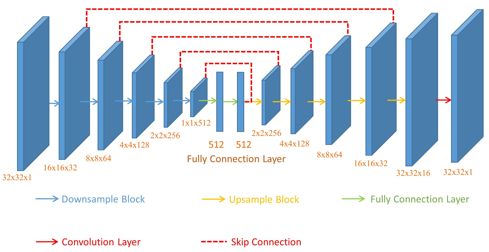
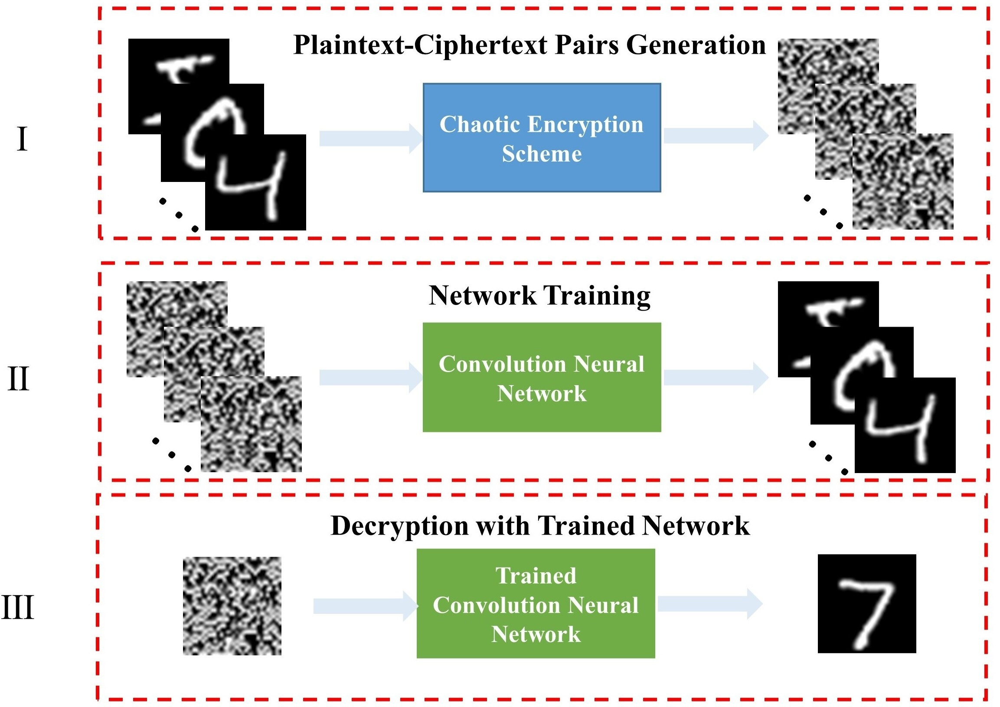

# A deep learning based known-plaintext attack method for chaotic cryptosystem
* The paper is under review.
* Paper [Link](https://arxiv.org/pdf/2103.05242.pdf)
## Overview

# data processing
* adopt image encryption scheme to encrypt images on Mnist or Mnist-Fashion or Cifar and etc.
* Cipher image as input of the proposed network.
* Original image as label of the proposed network. 

# Training
* update root "HOME and DATASET" in ./config.py.
* python train.py

# Testing
* python eval.py

# Evaluation metrics
* Pearson's correlation coefficient.

# Visualization
* python vis.py

# Environment
	python >=3.6 
	pytorch >=1.5
	opencv-python >=4.0
	scipy >=1.4.0
	h5py >=2.10
	pillow >=7.0.0
	imageio >=1.18

